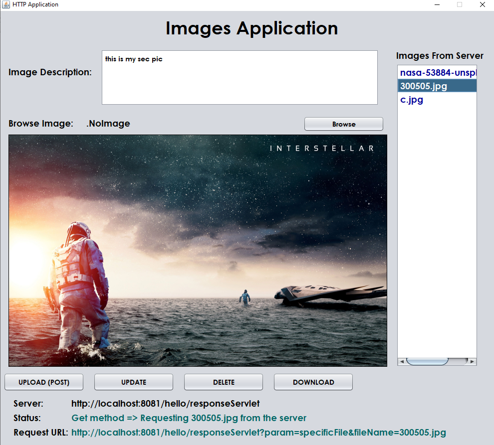
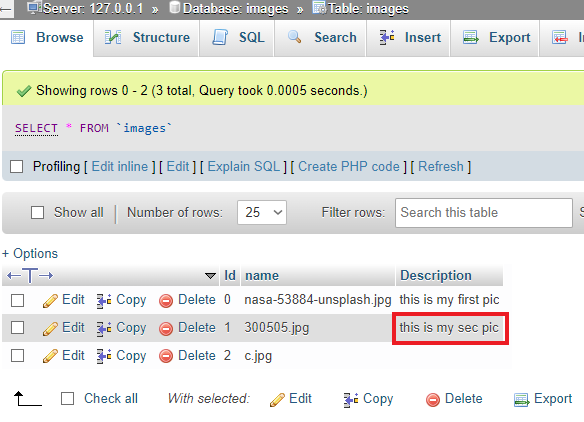

# ImagesApp-HTTP-JavaClient-Project-repo

<pre>
This Project Contains: 
 • Java Client application that connects to servers by using HTTP protocol.
 • Server-side applications by using Servlet with JAVA. which is receiving HTTP requests from the Java client and responding with corresponding HTTP responses.
</pre>

